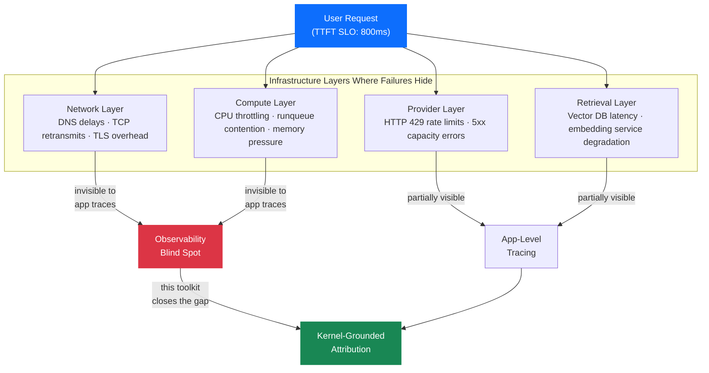
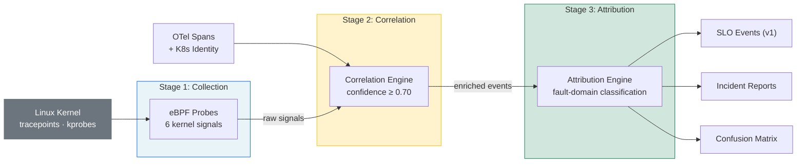
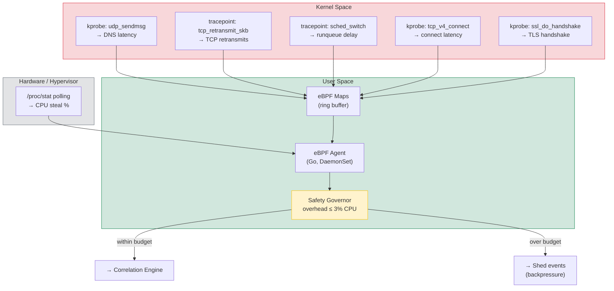
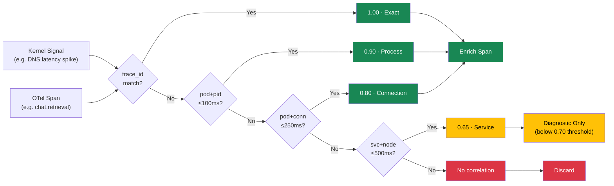
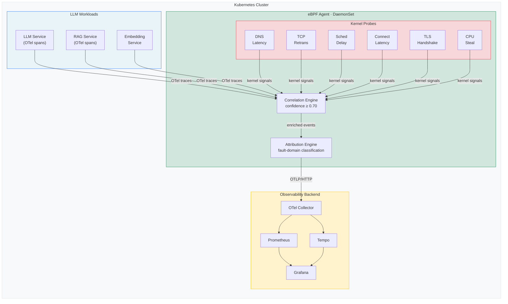
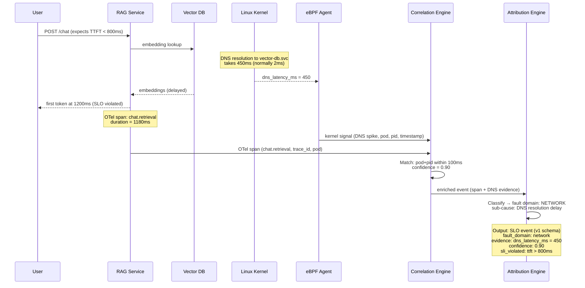
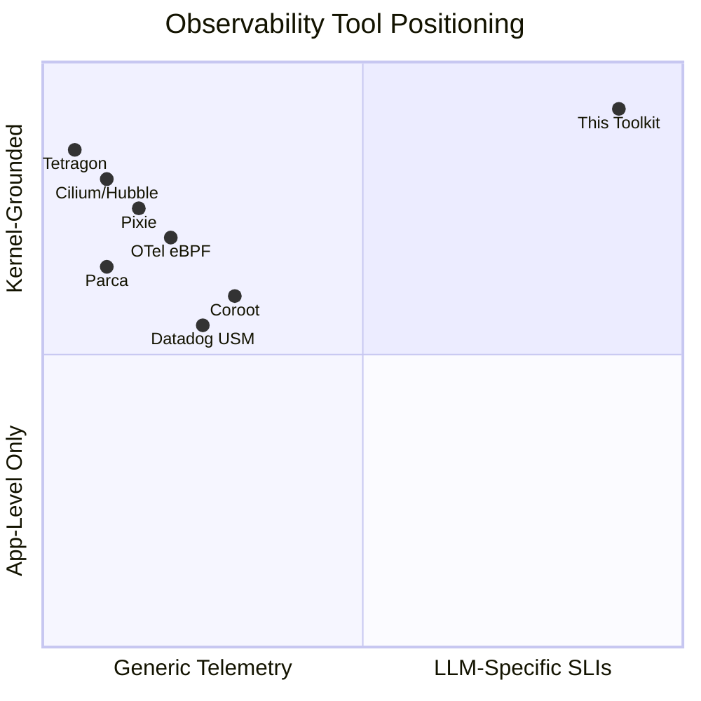
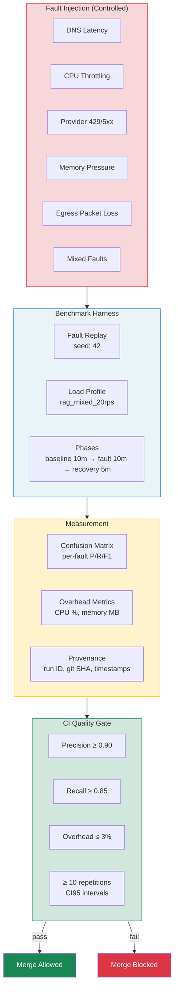
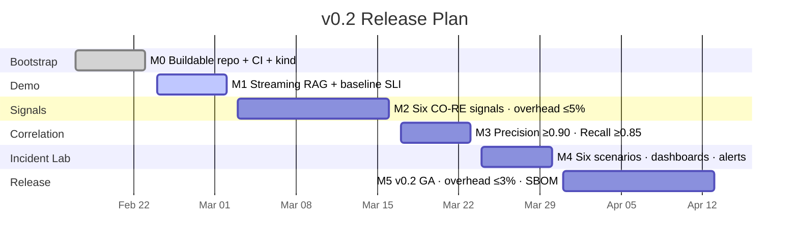

# LLM SLO eBPF Toolkit

**Kernel-grounded observability for LLM reliability engineering.**

A Kubernetes-native toolkit that uses eBPF to capture kernel-level signals — DNS latency, TCP retransmits, scheduling delays, connection timing, TLS handshakes, and CPU steal — and correlates them with OpenTelemetry traces and Kubernetes workload identity to produce causal incident attributions for LLM service-level objectives.

Production LLM systems fail in ways that application instrumentation alone cannot explain. When a retrieval-augmented generation service violates its time-to-first-token SLO, the root cause may be DNS resolution delays, provider throttling, noisy-neighbor CPU contention, or network packet loss — none of which are visible in application traces. This toolkit closes that observability gap by fusing kernel telemetry with application context, enabling SRE teams to attribute SLO violations to specific fault domains with measurable confidence.

## Problem

LLM inference workloads on Kubernetes exhibit failure modes that cross multiple infrastructure layers simultaneously. A single user-facing latency spike can originate from any layer — and often multiple layers interact:



Existing observability tools address subsets of this problem. Application-level tracing captures request flow but misses kernel-level causality. Network-focused eBPF tools (Cilium/Hubble, Pixie) provide infrastructure visibility but lack LLM-specific SLI semantics. Profiling tools (Parca, Elastic) measure resource consumption without linking it to SLO burn behaviour.

No existing open-source tool combines kernel-grounded signal collection with LLM-native SLI decomposition and causal attribution in a single pipeline.

## Approach

The toolkit operates as a three-stage pipeline deployed alongside LLM workloads:



### Stage 1: Kernel Signal Collection

Six eBPF programs attach to kernel tracepoints and kprobes using libbpf CO-RE (Compile Once, Run Everywhere) for portability across kernel versions. A BCC fallback path supports older hosts without BTF (BPF Type Format) support. Signals collected:

| Signal | Source | LLM Relevance |
|---|---|---|
| DNS latency | `kprobe/udp_sendmsg` | Retrieval backend and provider endpoint resolution |
| TCP retransmits | `tracepoint/tcp/tcp_retransmit_skb` | Network-layer contribution to TTFT degradation |
| Runqueue delay | `tracepoint/sched/sched_switch` | CPU contention from noisy neighbours |
| Connect latency | `kprobe/tcp_v4_connect` | Provider API connection overhead |
| TLS handshake time | `kprobe/ssl_do_handshake` | Encryption cost in provider communication |
| CPU steal | `/proc/stat` polling | Hypervisor-level resource contention |

The agent runs as a Kubernetes DaemonSet with configurable sampling and a safety governor that enforces a hard CPU overhead ceiling (development: 5%, production: 3%).



### Stage 2: Correlation Engine

Collected kernel signals are joined with OpenTelemetry spans using a tiered confidence model:

| Tier | Join Key | Window | Confidence |
|---|---|---|---|
| Exact | `trace_id` | In-window | 1.00 |
| Process | `pod` + `pid` | ≤ 100 ms | 0.90 |
| Connection | `pod` + `conn_tuple` | ≤ 250 ms | 0.80 |
| Service | `service` + `node` | ≤ 500 ms | 0.65 |

Only correlations at confidence ≥ 0.70 enrich spans. The 0.65 tier contributes to diagnostic views only, preventing low-confidence data from polluting attribution outputs. The correlation quality gate enforces precision ≥ 0.90 and recall ≥ 0.85 against a labeled evaluation dataset in CI.



### Stage 3: Attribution and SLO Diagnostics

Correlated events feed an attribution engine that classifies SLO violations into fault domains (network, compute, provider, retrieval) and produces structured outputs:

- **SLO events** aligned to a stable v1 JSON schema with LLM-specific SLIs: time-to-first-token (TTFT), token throughput, request latency, error rate, retrieval latency
- **Incident attributions** with fault-domain classification, confidence scores, and evidence chains
- **Confusion matrices** with per-fault precision, recall, and F1 scores
- **Provenance metadata** for audit and reproducibility

All outputs export via OTLP/HTTP to standard OpenTelemetry backends and via JSONL for offline analysis.

## Architecture



### Example: Attributing a TTFT SLO Violation

This sequence shows how the toolkit traces a user-facing latency spike to its kernel-level root cause:



## CI/CD Pipeline

Every pull request and nightly run passes through a multi-stage quality pipeline:

```mermaid
graph LR
    subgraph PR["Pull Request Gates"]
        BUILD["Build<br/>go build ./..."]
        LINT["Lint<br/>golangci-lint"]
        UNIT["Unit Tests<br/>go test ./..."]
        SCHEMA["Schema<br/>Validation"]
        CORR_GATE["Correlation<br/>Quality Gate<br/>P≥0.90 R≥0.85"]
        FAULT["Fault Injection<br/>Smoke"]
        OTLP_SMOKE["OTLP Export<br/>Smoke"]
    end

    subgraph NIGHTLY["Nightly (Self-Hosted Linux)"]
        KIND["kind Cluster<br/>Deploy"]
        EBPF_PRIV["Privileged eBPF<br/>Smoke"]
        OBS_SMOKE["Observability<br/>Stack Validation"]
        INCIDENT["Incident Smoke<br/>DNS · Retransmit · CPU"]
    end

    subgraph WEEKLY["Weekly"]
        FULL_MATRIX["Full Scenario<br/>Matrix"]
        REGRESSION["Release-Tag<br/>Regression"]
        REPORT["Benchmark<br/>Report Publish"]
    end

    PR --> NIGHTLY --> WEEKLY

    style PR fill:#e8f4f8,stroke:#0d6efd
    style NIGHTLY fill:#fff3cd,stroke:#ffc107
    style WEEKLY fill:#d1e7dd,stroke:#198754
```



## Key Results

Results from the current benchmark suite using controlled fault injection on a 3-node kind cluster:

| Metric | Value |
|---|---|
| Attribution accuracy (mixed faults) | 100% |
| Detection delay median | 2.50 s |
| False positive rate | 0.00 |
| False negative rate | 0.00 |
| Burn-rate prediction error | 0.07 |
| Collector CPU overhead | 2.20% |
| Collector memory overhead | 120 MB |
| Correlation precision | ≥ 0.90 (CI-gated) |
| Correlation recall | ≥ 0.85 (CI-gated) |

Benchmark artifacts (confusion matrices, predictions, provenance) are published with every CI run for independent verification.

## Technical Stack

- **Language**: Go 1.23
- **eBPF**: libbpf CO-RE (primary), BCC fallback for non-BTF hosts
- **Orchestration**: Kubernetes (kind for development, any conformant cluster for production)
- **Telemetry**: OpenTelemetry SDK, OTLP/HTTP exporters, Prometheus client
- **Observability**: Grafana, Prometheus, Tempo, OpenTelemetry Collector
- **Schemas**: JSON Schema for contract stability (v1 SLO events, v1 incident attributions, v1alpha1 probe events)
- **CI/CD**: GitHub Actions with nightly eBPF integration on self-hosted Linux runners

## Quick Start

### Prerequisites
- Go 1.23+
- Docker (for kind cluster)
- kubectl

### Build and Test
```bash
# Validate prerequisites
go run ./cmd/sloctl prereq check

# Build and run unit tests
make build && make test

# Run correlation quality gate
make correlation-gate
```

### Local Cluster Deployment
```bash
# Start 3-node kind cluster
make kind-up

# Deploy agent DaemonSet
kubectl apply -k deploy/k8s

# Deploy observability stack (Prometheus + Tempo + Grafana + OTel Collector)
kubectl apply -k deploy/observability

# Run observability smoke test
make kind-observability-smoke

# Tear down
make kind-down
```

### Agent and Collector
```bash
# Run agent with OTLP export
go run ./cmd/agent --count 3 --output otlp --otlp-endpoint http://127.0.0.1:4318/v1/logs

# Run collector with fault injection input
go run ./cmd/faultinject --scenario mixed --count 24 --out artifacts/fault-injection/raw_samples.jsonl
go run ./cmd/collector --input artifacts/fault-injection/raw_samples.jsonl --output jsonl --output-path artifacts/collector/slo-events.jsonl

# Run deterministic RAG demo service
go run ./demo/rag-service --bind :8080 --metrics-bind :2113
```

### Benchmarks and Fault Injection
```bash
# Generate fault replay samples
go run ./cmd/faultreplay --scenario mixed --count 30 --out artifacts/fault-replay/fault_samples.jsonl

# Build benchmark report from replay samples
go run ./cmd/benchgen --out artifacts/benchmarks-replay --scenario mixed_faults --input artifacts/fault-replay/fault_samples.jsonl

# Run chaos fault matrix
make chaos-matrix
```

## Project Structure

```
cmd/
├── agent/           # eBPF data collection agent (DaemonSet)
├── collector/       # SLO event normalization pipeline
├── attributor/      # Fault-to-incident attribution engine
├── benchgen/        # Benchmark artifact generator
├── faultreplay/     # Synthetic fault scenario streams
├── faultinject/     # Raw fault injection harness
├── correlationeval/ # Correlation quality gate evaluator
├── sloctl/          # CLI prerequisite checker
└── loadgen/         # Load generation utility

pkg/
├── schema/          # v1 JSON schema types (SLOEvent, IncidentAttribution, ProbeEvent)
├── collector/       # Sample generation and normalization
├── attribution/     # Fault classification and confusion matrix
├── correlation/     # Span-signal correlation with confidence tiers
├── otel/            # OTLP/HTTP exporters for SLO events
├── benchmark/       # Benchmark harness and artifact generation
├── faultreplay/     # Multi-domain fault scenario engine
├── signals/         # Kernel signal models
├── slo/             # SLO burn-rate calculation
├── safety/          # Overhead guards and rate limiters
├── semconv/         # Semantic conventions (llm.ebpf.*)
└── toolkitcfg/      # Configuration management

ebpf/
├── c/               # eBPF C programs (CO-RE)
├── bcc-fallback/    # BCC scripts for non-BTF hosts
└── headers/         # vmlinux.h and helpers

deploy/
├── k8s/             # DaemonSet, ConfigMap, RBAC
├── observability/   # Prometheus, Tempo, Grafana, OTel Collector
└── kind/            # Local cluster configuration

docs/
├── contracts/       # Stable v1 and alpha schema definitions
├── benchmarks/      # Benchmark methodology and reports
├── strategy/        # Differentiation analysis and roadmap
└── research/        # Competitive landscape sources
```

## Differentiation

This toolkit occupies a specific position in the observability landscape that no existing tool addresses:



| Capability | This Toolkit | OTel eBPF | Pixie | Cilium/Hubble | Coroot |
|---|---|---|---|---|---|
| LLM-specific SLI decomposition (TTFT, token throughput) | Yes | No | No | No | No |
| Kernel-to-span causal attribution | Yes | Partial | Partial | No | Partial |
| Fault-domain incident classification | Yes | No | No | No | Limited |
| Reproducible benchmark methodology | Yes | No | No | No | No |
| Confidence-gated correlation | Yes | No | No | No | No |
| Overhead-gated safety controls | Yes | No | Partial | N/A | Partial |

**Three pillars of differentiation**:

1. **No-code kernel telemetry baseline** — captures infrastructure signals even when application instrumentation is partial or absent, reducing dependency on per-team tracing maturity.

2. **LLM-native SLI semantics** — models time-to-first-token, token throughput collapse, provider error classification, and retrieval contribution as first-class SLIs rather than generic HTTP metrics.

3. **Causal attribution with measured confidence** — correlates kernel events with application traces and Kubernetes identity to produce fault-domain hypotheses with published precision/recall/F1, treating uncertainty as a first-class output rather than hiding it.

## Methodology and Reproducibility

The project follows publishable benchmark standards with a controlled experimental pipeline:



- **Controlled fault injection**: deterministic scenarios for DNS latency, CPU throttling, provider rate limiting, memory pressure, egress packet loss, and mixed-fault conditions
- **Statistical requirements**: minimum 10 repetitions per profile, CI95 confidence intervals, class balance reporting
- **Transparency**: confusion matrices, abstain rates, and provenance metadata published with every benchmark run
- **Reproducibility**: seeded random generation (seed: 42), canonical load profiles, and versioned fault manifests
- **CI-enforced quality gates**: correlation precision ≥ 0.90 and recall ≥ 0.85 block merges when violated

This methodology is designed to meet the evidentiary standards of peer-reviewed systems research, enabling independent verification of all attribution accuracy claims.

## Roadmap



| Milestone | Status | Key Deliverables |
|---|---|---|
| M0: Bootstrap | Complete | Buildable repo, kind cluster, CI pipeline, DaemonSet heartbeat |
| M1: Demo + OTel | In progress | Streaming RAG demo, baseline TTFT/tokens-per-second, first correlated signal |
| M2: Signals v1 | Planned | Six CO-RE signals, schema validation, safety toggles, overhead ≤ 5% |
| M3: Correlation | Planned | Production correlator, retrieval decomposition, retry storm detection |
| M4: Incident Lab | Planned | Six deterministic scenarios, Grafana dashboards, alerting rules |
| M5: Bench + Release | Planned | v0.2 GA, overhead ≤ 3%, signed artifacts with SBOM and provenance |

## Documentation

| Document | Description |
|---|---|
| [Differentiation Strategy](docs/strategy/differentiation-strategy.md) | Competitive analysis against 10 adjacent tools with gap assessment |
| [v0.2 Build Plan](docs/strategy/v0.2-build-plan.md) | Milestone schedule, hard gates, and acceptance criteria |
| [Go/No-Go Checklist](docs/strategy/v0.2-go-no-go-checklist.md) | Release gate tracking for contract, signal, correlation, and benchmark readiness |
| [Why This Exists](docs/strategy/why-this-exists-security-sre.md) | Problem statement for SRE, platform, and security teams |
| [Demo Stories](docs/strategy/killer-demo-stories.md) | Five demo scenarios with measurable win conditions |
| [SLO Event Schema](docs/contracts/v1/slo-event.schema.json) | Stable v1 contract for SLO event outputs |
| [Attribution Schema](docs/contracts/v1/incident-attribution.schema.json) | Stable v1 contract for incident attribution outputs |
| [Benchmark Specification](docs/benchmarks/llm-slo-attribution-accuracy.md) | Experimental design, statistical requirements, and publishability criteria |
| [Benchmark Reports](docs/benchmarks/reports/) | Latest attribution accuracy, overhead, and regression results |
| [Configuration Schema](config/toolkit.schema.json) | Toolkit configuration reference |
| [Runner Security Baseline](docs/security/self-hosted-runner-baseline.md) | CI runner isolation and credential management |

## Licence

MIT
